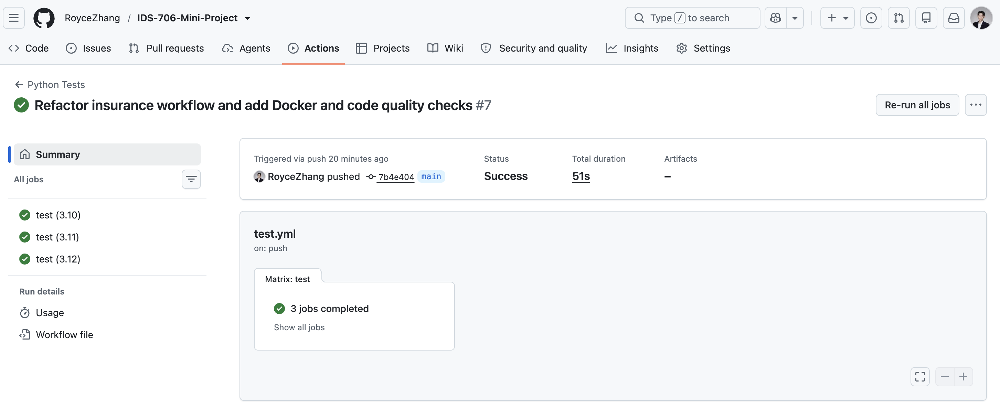
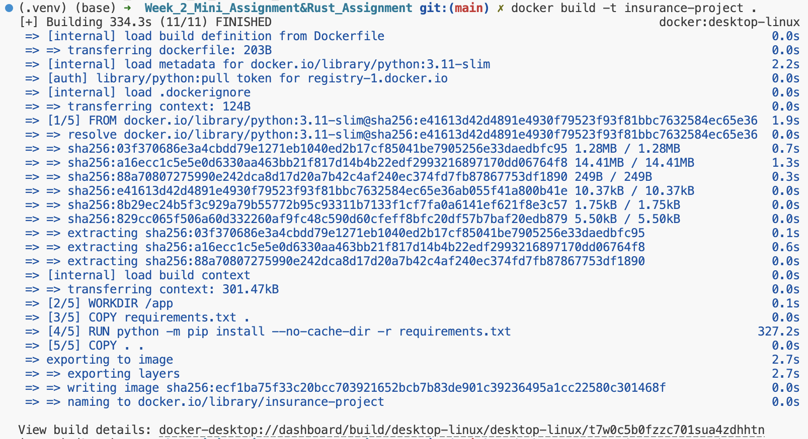
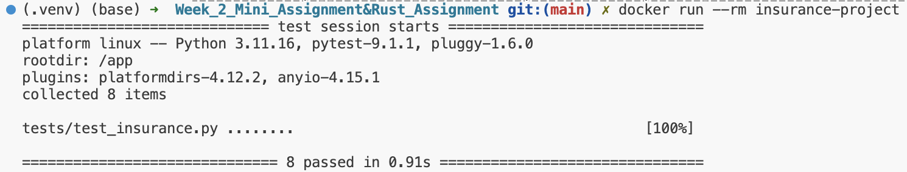
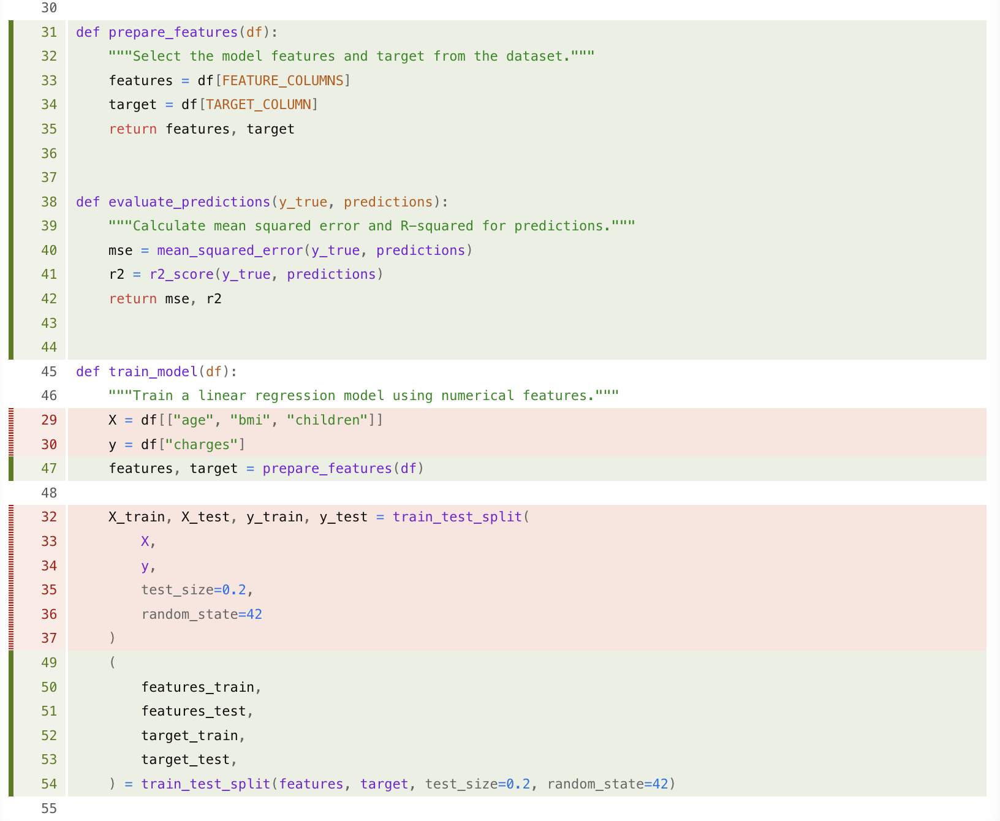

[](https://github.com/RoyceZhang/IDS-706-Mini-Project/actions/workflows/test.yml)

# Medical Insurance Cost Analysis and Prediction

## Project Overview

This student project explores medical insurance data with Pandas and uses a
Linear Regression model to predict insurance charges. It combines data loading,
cleaning, filtering, grouped analysis, visualization, machine learning, testing,
continuous integration, and reproducible execution with Docker.

## Dataset

The project uses the
[Medical Cost Personal Dataset](https://www.kaggle.com/datasets/mirichoi0218/insurance).
The included `insurance.csv` file contains age, sex, BMI, number of children,
smoking status, region, and medical insurance charges. The machine learning
target is `charges`.

## Problem Statement

The analysis asks how personal characteristics relate to medical insurance
costs and builds a simple baseline model that predicts charges from three
numerical features: age, BMI, and number of children.

## Data Cleaning

The dataset is inspected with Pandas methods such as `head()`, `info()`,
`describe()`, `isnull().sum()`, and `duplicated().sum()`. The reusable
`preprocess_data()` function removes duplicate rows before modeling.

## Exploratory Analysis

The notebook filters people older than 50 and people who smoke. It also groups
the data by smoking status and region to compare counts and average charges. A
scatter plot of BMI versus charges helps show their relationship visually.

The notebook also compares a repeated grouping operation in Pandas and Polars.
Pandas is faster for this small dataset, while Polars is designed to be
efficient on larger, column-oriented workloads.

## Machine Learning

Linear Regression is used because `charges` is continuous. The model uses age,
BMI, and number of children as input features. A train-test split keeps some
rows out of training so the predictions can be evaluated with:

- Mean Squared Error (MSE)
- R-squared

The notebook also explores separate models for smokers and non-smokers because
their average charges differ substantially.

## Key Findings

- Smoking status separates groups with noticeably different average charges.
- Filtering and grouping provide clear comparisons among patient groups.
- BMI can be compared with charges visually, although it is not the only factor
  that affects cost.
- The three-feature Linear Regression model is a useful, understandable
  baseline rather than a complete explanation of insurance pricing.

## Installation

Python 3.10, 3.11, or 3.12 is recommended. From the repository root, create and
activate a virtual environment, then install the dependencies:

```bash
python -m venv .venv
source .venv/bin/activate
python -m pip install -r requirements.txt
```

On Windows, activate the environment with `.venv\Scripts\activate`.

## Running the Project

Open `week2_insurance_linear_regression.ipynb` in Jupyter to run the exploratory
analysis:

```bash
jupyter notebook week2_insurance_linear_regression.ipynb
```

The reusable analysis and machine learning functions are in
`insurance_project.py`.

## Testing

The pytest suite covers loading, duplicate removal, smoker filtering, grouped
summaries, feature preparation, prediction evaluation, and the complete model
workflow. It includes edge cases for an explicitly duplicated row and for a
dataset containing no smokers.

```bash
python -m pytest
```

## Continuous Integration

The GitHub Actions workflow runs automatically on pushes and pull requests to
`main`. It tests Python 3.10, 3.11, and 3.12 and runs all three quality checks:

```bash
python -m pytest
black --check insurance_project.py tests/
flake8 insurance_project.py tests/
```


The badge at the top of this README reports the workflow status.

## Docker

The Docker image uses Python 3.11 slim, installs `requirements.txt`, copies the
project, and runs the pytest suite by default. No ports are exposed because this
project is not a web application.

```bash
docker build -t insurance-project .
docker run --rm insurance-project
```

### Docker Build



### Docker Run




## Refactoring and Code Quality

The original `train_model()` selected features, split the data, trained the
model, generated predictions, and calculated metrics. It was refactored into
small beginner-friendly pieces:

- `FEATURE_COLUMNS` and `TARGET_COLUMN` define the model inputs and output.
- `prepare_features()` selects the model columns.
- `evaluate_predictions()` calculates MSE and R-squared.
- `train_model()` coordinates the split, training, prediction, and helper calls.

This reduces the responsibility of `train_model()` and makes feature selection
and evaluation independently reusable and testable. The refactoring is verified
with pytest, Black formatting checks, and flake8 linting locally and in CI.



## Project Structure

```text
.
├── .github/workflows/test.yml
├── .dockerignore
├── .gitignore
├── Dockerfile
├── README.md
├── insurance.csv
├── insurance_project.py
├── requirements.txt
├── tests/
│   └── test_insurance.py
└── week2_insurance_linear_regression.ipynb
```

## Conclusion

This project demonstrates a reproducible workflow for exploring medical
insurance costs and building a baseline regression model. The code remains
small enough for a student project while automated tests, CI checks, and Docker
make the results easier to verify. Future work could add categorical variables
such as smoking status, sex, and region to compare model performance.
